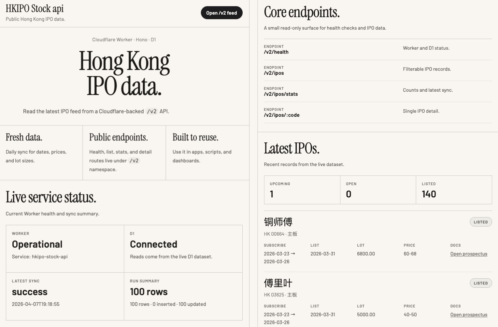
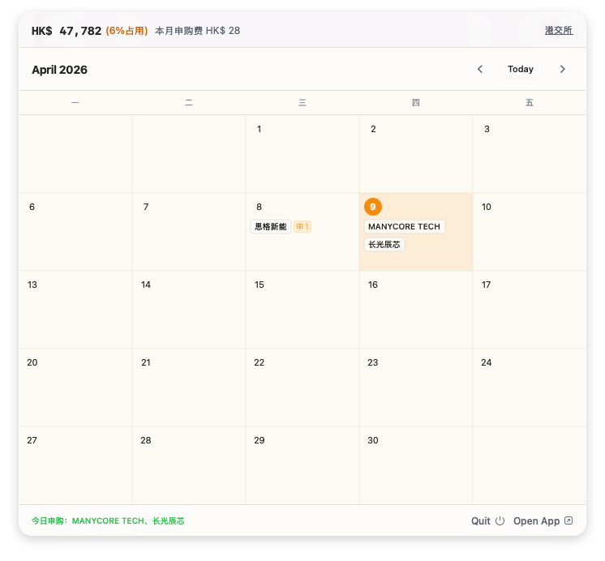

# HKIPO Stock api

Cloudflare Worker + Hono + D1 backend for Hong Kong IPO data.

Backend landing page:



macOS app preview:



## What It Does

- Serves a landing page at `/` with service status and the latest 10 IPO rows
- Exposes read-only APIs under `/v2/...`
- Runs a daily Cloudflare `scheduled` task at 09:00 GMT+8 (01:00 UTC) to fetch and normalize IPO data from Jina


## Stack

- Hono
- Cloudflare Workers
- Cloudflare D1

## Local Setup

1. Install dependencies:

```bash
npm install
```


2. Edit `wrangler.jsonc` and fill in your own values:

- Set `name`
- Set `workers_dev` or `routes`
- Set `d1_databases[].database_name`
- Set `d1_databases[].database_id`

3. Create local secrets in `.dev.vars` and keep the file untracked:

```bash
cp .dev.vars.example .dev.vars
```


4. Start local development server:

```bash
npm run dev
```


## API

- `GET /v2/ipos`
- `GET /v2/ipos/:code`
- `GET /v2/ipos/stats`
- `GET /v2/health`

## Deployment Notes

- Set the `JINA_KEY` secret before deploying:

```bash
npx wrangler secret put JINA_KEY
```
